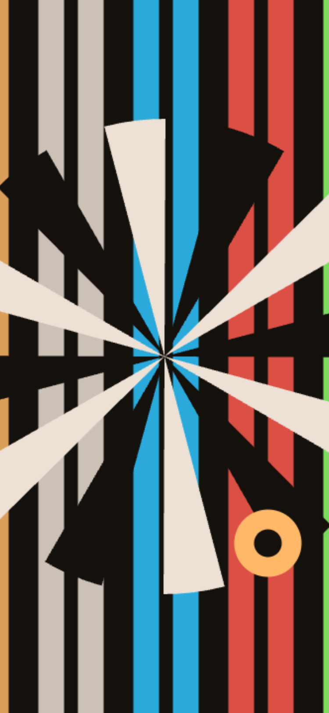
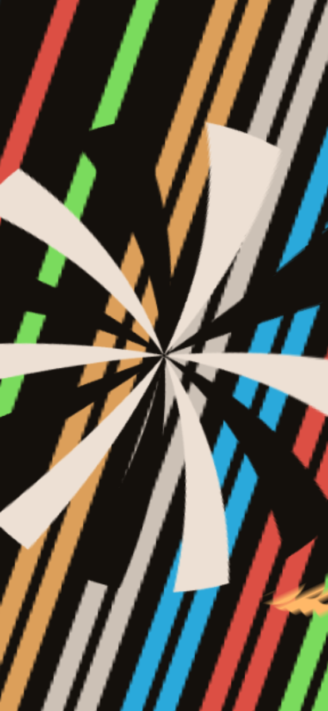

# SPLIIIT

**A slit-scan browser camera for iPhone, with slitscanning beyond vertical and
horizontal — a line, a burst, and a force field.**

This is a prototype and a design project. It is not a product, there is no app
store listing, and it will probably never have one. It exists because I love
photography, and because slit-scan images sit between photography and video and allow you to show space in constricted ways.

**[Open the current build →](https://brunexledlex.github.io/Splitscan/v2.html)**



---

## What a slit-scan is

An ordinary photograph samples the whole frame at one instant. A slit-scan
samples a *thin slice* of the frame, over and over, and lays the slices out in
order. One axis of the resulting picture is no longer space — it is time.

The consequence is strange and specific: a single still image can hold hundreds
of different moments simultaneously, stitched into something that looks
continuous but never existed.

## Why

Slit-scan keeps being reinvented, usually by accident, and always beautifully.

**Photo-finish cameras**, from the 1930s onward, drew a moving strip of film past
a narrow slit. The horizontal axis of those negatives is time, which is exactly
why they settle a race: two horses that were never side by side appear side by
side, ordered by when they crossed the line.

**Jacques Henri Lartigue** photographed a car at the 1912 Grand Prix de l'Automobile
Club de France with a focal-plane shutter travelling vertically while the car
moved horizontally. The wheel leans into an oval; the spectators lean the other
way. The distortion is the picture.

**Marey and Muybridge** had already been taking time apart into frames a few
decades earlier. Slit-scan is the same impulse run continuously instead of in
steps — no frames, just a smear.

**2001: A Space Odyssey** built its stargate corridor on a slit-scan rig: artwork,
a slit, and a camera crawling along a track, one long exposure per frame.

And your phone does it already, badly and by accident. A CMOS sensor reads out
row by row rather than all at once, so the bottom of the frame is a few
milliseconds younger than the top. **Rolling
shutter is an uncontrolled slit-scan.** This app is the same effect with the
controls put back in.

## The shapes

Every slit here is the same idea: time is a scalar field over the frame, and the
slit is the contour where that field equals *now*. Only the distance function
changes, which is why three very different-looking effects share one engine.

| Shape | The field | Reads as |
|---|---|---|
| **Swipe** | distance along a normal — a straight line, at any angle | Diagonal time. The classic slit-scan, freed from vertical/horizontal. |
| **Burst** | distance from a centre — a ring | A sunburst. Anything moving smears along rays, because neighbouring radii are neighbouring moments. |
| **Field** | distance from a band — two mirrored lines | A force field. A live, untouched strip down the middle; time peels away from it in both directions at once. |

<table>
<tr>
<td width="33%"><br><sub><b>Burst</b> · sunburst</sub></td>
<td width="33%"><br><sub><b>Field</b> · live band, time peeling outward</sub></td>
<td width="33%"><br><sub><b>Swipe</b> · angled, anti-aliased</sub></td>
</tr>
</table>

Every image above came out of the app itself, scanning the built-in demo source
— no camera, no post-processing.

## Using it

**Swipe the picture to choose the slit**, rather than aiming it by hand:

| Shape | swipe | does |
|---|---|---|
| Swipe | up / down / left / right | the slit enters from behind the direction you dragged |
| Burst | up / down | expands outward from the centre, or contracts inward |
| Field | up / down · left / right | widens or narrows the live band · rotates it 90° |

In **Field**, the band is also set directly: **drag either handle** on its edge —
across to change width, around to rotate. A minimum width keeps the two handles
from ever meeting at the centre, which is exactly where a swipe begins.

**One press is one exposure.** Tap the shutter and the slit runs its full
traverse — edge to edge for Swipe, centre to rim for Burst, band to edge for
Field — and the picture is captured automatically the instant it finishes. The
shutter ring is the progress meter. A second tap cuts the exposure short and
captures where it stands.

Every capture is **archived automatically** with a unique name — no dialog, no
tap, straight back to a live feed so you can shoot again immediately. The
**roll** — top bar, left of Settings — holds the session's captures as
thumbnails. Open it, deselect anything you don't want, and **Save** hands the
rest to the share sheet in one gesture, so twenty captures cost one tap rather
than twenty.

**Anti-aliasing** (Settings) swaps the renderer for a WebGL engine that keeps a
short rolling history of frames and samples it with sub-pixel and sub-frame
interpolation, which is what removes the stair-stepping a slit-scan normally
has along fast-moving edges. It costs real GPU memory, shown live in Settings,
and is capped so it can't be pushed past what an iPhone can hold.

**Capture size** follows the device by default — the true screen resolution, not
a fixed export size — with a 2× option for when the source can support it.

Sources: rear camera, front camera, or a built-in synthetic demo so the app
does something before it asks for permissions.

## Install

Two builds live side by side:

```
v2.html      the current app — SPLIIIT, all three shapes, anti-aliasing, the roll
index.html   the original prototype (Sweep / Radial / Strip, the darkroom UI)
```

No build step, no dependencies. Serve the folder:

```bash
python3 -m http.server 3468
```

**The camera needs an `https://` origin.** Safari only exposes
`navigator.mediaDevices` on a secure context — over plain `http://` to a LAN
address it does not exist at all, and the app tells you so rather than failing
on tap. `localhost` counts as secure; a LAN IP does not. The demo source works
anywhere.

Served over HTTPS, open it in Safari on the phone and use **Share → Add to Home
Screen**. It then launches fullscreen, and the service worker keeps it working
with no network and no server. Pages are cached under their own URL, so `v2.html`
and `index.html` update independently on the next online launch.

## How it works

- **One time field, three shapes.** `stepFor()` dispatches to `stepSwipe` /
  `stepBurst` / `stepField`, but all three paint with `clip()` + `drawImage()` —
  never per-pixel — so an angled or curved slit costs the same as a straight
  one, and each frame paints the whole span since the last tick rather than a
  slit at one position, which is what keeps fast motion gap-free.
- **The anti-aliasing engine is WebGL2.** A `TEXTURE_3D` ring buffer holds the
  last *N* downscaled frames; every tick, one fragment shader pass re-renders
  the whole image by computing each pixel's time and sampling the history at
  that depth, with hardware bilinear filtering for the spatial axis and an
  explicit blended tap for the temporal one. History resolution is decoupled
  from output resolution, so a modest buffer reads as soft rather than blocky.
- **The lime line is the slit itself**, not a decoration — drawn at full
  strength in every state so there is always a visible reference for where the
  scan is reading, on its own canvas so it never bakes into a capture.
- **The roll is IndexedDB, not the photo library.** Safari requires a live user
  gesture for both `navigator.share` and downloads, and a pass takes several
  seconds — well past that window — so nothing can write to Photos
  unattended. The roll is what makes one gesture cover a whole session instead
  of one per capture.
- **Capture follows the device.** Buffers accumulate at the viewport's own
  aspect and true pixel density, guarded against iOS's canvas area ceiling,
  rather than a fixed export size that would crop a portrait photo into a
  landscape frame.

`window.__slit2.burn(n, dt)` steps *n* frames of synthetic time, which is how
every shape, gesture and capture path here gets tested without depending on
`requestAnimationFrame` or a real camera.

See [DESIGN.md](DESIGN.md) for the design rationale, and
[docs/](docs/) for the working specs written before each feature was built.

## Status: prototype

Honest about what this is:

- **The on-device camera path is the least-tested part**, on both builds. The
  geometry, the gestures, and every shape/anti-aliasing combination are
  verified by stepping synthetic time; a real camera on real glass has not been
  pointed at either build.
- Stills only. No video export.
- Settings do not persist between launches; the roll does, in IndexedDB, up to
  40 captures or 250 MB, oldest evicted first.
- One theme, deliberately dark. A camera that flips to white would wreck your
  night vision and your judgement of the image.
- Tested in the browsers available during development. Not audited across
  devices.

## Files

```
v2.html                 current app
index.html              original prototype
sw.js                   offline shell, shared by both builds
manifest.webmanifest    home-screen install
icon-*.png              generated, not drawn
logo.svg                the SPLIIIT wordmark, inlined into v2.html
tools/make-icons.mjs    regenerates the icons — node tools/make-icons.mjs
examples/               stills from the app, used in this README
docs/                   working specs, written before each feature was built
```

## Credits

Concept, design and code by [Bruno Silva](https://ditongo.com) —
[Ditongo](https://ditongo.com), a design studio in Lisbon — built together with
Claude.

## License

[MIT](LICENSE). Take it apart.
