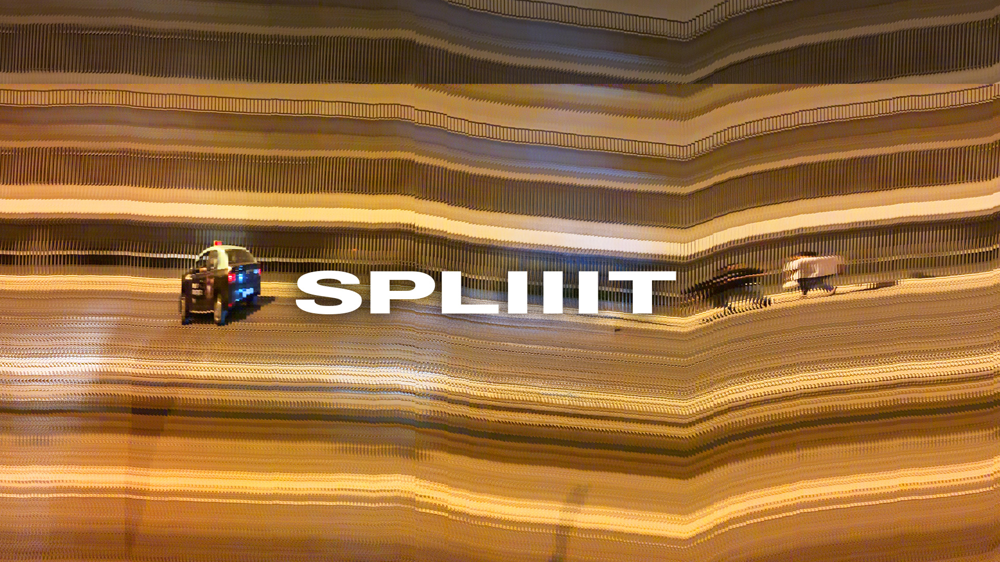

# SPLIIIT

**A slit-scan browser camera for iPhone and web — four capture modes that reveal motion across time.**

A slit-scan photographs a thin *slice* of the frame, over and over. One axis of the image becomes time instead of space, holding hundreds of moments in a single frame.

**[Open the app →](https://brunexledlex.github.io/Splitscan/)**

---

## Four modes

**Swipe** · a straight slit at any angle  
**Burst** · a radial slit, reading as a sunburst  
**Strip** · a fixed edge slit, like a photo-finish camera  
**Field** · a live band down the centre (retired from the bar, code intact)

## Using it

**First run** · A splash card explains what the app is and warns that the camera prompt is coming; **Continue** is what triggers it. Camera only — the app never asks for the microphone. Shown once per browser.

**Swipe the screen** to aim the slit — up/down/left/right for Swipe, up/down to expand/contract Burst.

**Slice thickness** · Press the mint pill on the left edge and drag up: 1–60 pixels. Tap to reset to 1px.

**Capture** · Tap the shutter. The slit runs its full traverse and the frame captures automatically. A second tap cuts the exposure early.

**Roll** · Top bar, left of Settings. Thumbnails of your session. Deselect unwanted captures, tap **Close**, and **Save** to export the rest.

**Capture size** · Settings → Experimental. Screen (viewport aspect at native resolution), Panorama (3000 × 1688, true 16:9 landscape however you hold the phone), or Infinite (3000px wide, screen height). All show live pixel dimensions. The viewfinder stays full-bleed in every mode — the wider buffers are cropped to the screen for framing, never letterboxed, and the export is always the whole buffer.

**Anti-aliasing** (Experimental) · WebGL time-displacement engine. Keeps a rolling history of frames and sub-pixel/sub-frame interpolates them, removing stair-stepping at fast motion edges. GPU memory is shown live and capped to iPhone limits.

**Sources** · Rear camera, front camera, or built-in demo (works offline).

## Deploy

No build step, no dependencies. The app is a single-page HTML file with embedded CSS and JS.

Locally, serve the folder:
```bash
python3 -m http.server 3468
```

**Camera requires HTTPS.** Safari only exposes `navigator.mediaDevices` over secure contexts; the demo source works anywhere.

On HTTPS, use **Share → Add to Home Screen** in Safari to install fullscreen. The service worker caches pages for offline use.

## Implementation

- **Canvas 2D engine:** `clip()` + `drawImage()` to paint time fields. One `stepFor()` dispatch covers all modes.
- **WebGL2 AA engine:** `TEXTURE_3D` ring buffer with time-history sampling, bilinear spatial filtering, temporal blending.
- **IndexedDB roll:** Captures stored client-side; no photo library dependency means capture doesn't require live user gesture.
- **Responsive capture:** Buffers use viewport aspect and device pixel density, capped to iOS canvas limits.

See [DESIGN.md](DESIGN.md) for design rationale and [docs/](docs/) for pre-implementation specs.

## Limits

- **Stills only.** No video export.
- **Settings don't persist** between sessions. The roll (IndexedDB) does — up to 40 captures or 250 MB, oldest evicted first — as do the lifetime capture count and the first-run flag (localStorage). Clearing site data brings the splash back.
- **Dark theme only.** A white camera would destroy your night vision and image judgement.
- **Real camera path is least-tested.** Geometry and gestures are verified via synthetic time-stepping; a live camera hasn't been extensively used yet.

## Files

```
index.html              the app (four modes, Warp, anti-aliasing, roll)
legacy/index.html       v1 prototype (three modes, darkroom UI)
v2.html                 redirect to index.html (backward compat)
sw.js                   service worker (offline caching, v10)
manifest.webmanifest    PWA install / home-screen config
assets/                 icons, favicons, mode SVGs, blank-roll
tools/make-icons.mjs    icon generation (node tools/make-icons.mjs)
docs/                   pre-implementation specs
```

## Author

[Bruno Silva](https://ditongo.com) — [Ditongo](https://ditongo.com) design studio, Lisbon.

## License

[MIT](LICENSE). Take it apart.
