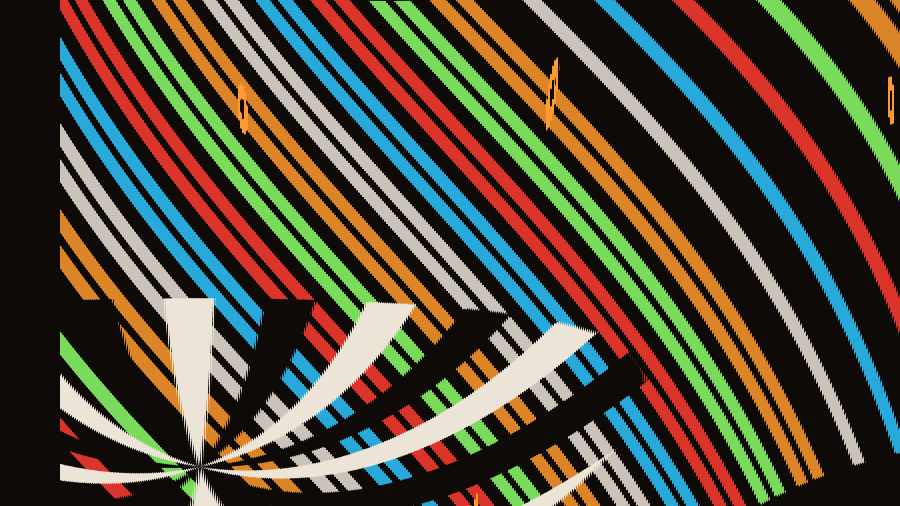

# Slitscan

**A slit-scan camera for the iPhone, with slit geometries beyond vertical and
horizontal — angled, and rotating.**

This is a prototype and a design project. It is not a product, there is no app
store listing, and it will probably never have one. It exists because I love
photography, and because slit-scan is the corner of photography where the
camera stops describing space and starts describing time.


---

## What a slit-scan is

An ordinary photograph samples the whole frame at one instant. A slit-scan
samples a *thin slice* of the frame, over and over, and lays the slices out in
order. One axis of the resulting picture is no longer space — it is time.

The consequence is strange and specific: a single still image can hold hundreds
of different moments simultaneously, stitched into something that looks
continuous but never existed.

## Why

Slit-scan keeps being reinvented, usually by accident, and always beautifully.

**Photo-finish cameras**, from the 1930s onward, drew a moving strip of film past
a narrow slit. The horizontal axis of those negatives is time, which is exactly
why they settle a race: two horses that were never side by side appear side by
side, ordered by when they crossed the line.

**Jacques Henri Lartigue** photographed a car at the 1912 Grand Prix de l'Automobile
Club de France with a focal-plane shutter travelling vertically while the car
moved horizontally. The wheel leans into an oval; the spectators lean the other
way. The distortion is the picture.

**Marey and Muybridge** had already been taking time apart into frames a few
decades earlier. Slit-scan is the same impulse run continuously instead of in
steps — no frames, just a smear.

**2001: A Space Odyssey** built its stargate corridor on a slit-scan rig: artwork,
a slit, and a camera crawling along a track, one long exposure per frame.

And your phone does it already, badly and by accident. A CMOS sensor reads out
row by row rather than all at once, so the bottom of the frame is a few
milliseconds younger than the top. That is why propellers bend and why a
guitar string photographed on a phone looks like it is made of rubber. **Rolling
shutter is an uncontrolled slit-scan.** This app is the same effect with the
controls put back in.

## What's new here

Slit-scan software almost always gives you a vertical slit or a horizontal one.
The slit is a *line*, though, and a line has an angle — and an angle can change
while you scan. That is the whole idea:

| Mode | The slit | Reads as |
|---|---|---|
| **Sweep** | A straight slit at any angle travels across the frame. Each band is frozen at the moment the slit crossed it. | Diagonal time. A picture sliced along an axis that isn't the sensor's. |
| **Radial** | A slit anchored at a movable pivot **rotates**, like a radar sweep. Every wedge holds a different instant. | A clock face where each hour is a different moment. **1–4 blades** give 2, 3, or 4-fold symmetry of time. |
| **Strip** | The classic stacking scan — one slice per frame at the trailing edge — except the sample line is free to **rotate while it stacks**. | Fanned, curved time. Straight lines in the world become arcs. |

<table>
<tr>
<td width="33%"><br><sub><b>Sweep</b> · 28°</sub></td>
<td width="33%"><br><sub><b>Radial</b> · one blade, off-centre pivot</sub></td>
<td width="33%"><br><sub><b>Strip</b> · rotating sample line</sub></td>
</tr>
</table>

Every image in this README came out of the app itself, scanning the built-in
demo source — no camera, no post-processing.

## Using it

**Auto** hands the slit to the machine; the driven slider turns amber and reads
out live. **Manual** hands it to you.

The part worth trying first: in Manual, **drag anywhere on the picture.** In
Radial you spin the blade with your thumb, painting time by hand — fast where you
flick, slow where you linger, and the image records your gesture as smear. In
Sweep you drag the slit back and forth across the frame. Touching the picture
switches to Manual on its own.

- In Radial and Strip, **drag the crosshair** to move the pivot off-centre. It
  changes the picture completely; the examples above use it.
- **Hold** pauses accumulation without dropping the camera, so you can recompose
  and resume into the same image.
- **Save** writes a PNG. On iPhone it opens the share sheet, so *Save Image*
  drops it into Photos.
- The bezel and blade are an overlay on a separate canvas. They never appear in
  what you save.

Sources: rear camera, front camera, a video from your library, or a built-in
synthetic demo so the app does something before it asks for permissions.

Desktop keyboard: `space` hold · `c` clear · `g` guides.

## Install

Four files, no build step, no dependencies. Serve the folder:

```bash
python3 -m http.server 3468
```

**The camera needs an `https://` origin.** Safari only exposes
`navigator.mediaDevices` on a secure context — over plain `http://` to a LAN
address it does not exist at all, and the app tells you so rather than failing
on tap. `localhost` counts as secure; a LAN IP does not. Demo and video-file
sources work anywhere.

Served over HTTPS, open it in Safari on the phone and use **Share → Add to Home
Screen**. It then launches fullscreen, and the service worker keeps it running
with no network and no server.

## How it works

The interesting constraint is that this has to hold 60fps on a phone, which
rules out touching pixels in JavaScript.

- **Slices are painted with `clip()` + `drawImage()`**, never per-pixel. A
  rotated quad for Sweep, an arc wedge for Radial, a rect for Strip. The browser
  composites these on the GPU, so an angled slit costs the same as a straight
  one.
- **Each frame paints the whole span** from the previous slit position to the
  current one, rather than a slit at one position. This is what stops fast spins
  and sweeps from leaving gaps, and it means the output is independent of frame
  rate.
- **Two stacked canvases.** One accumulates the artwork and is the only thing
  exported; the other carries the reticle and is cleared every frame.
- **Strip mode rotates the source, not the slice.** To lay an angled sample line
  down as a vertical column, it rotates the source by `π/2 − θ` about the sample
  point under a clip of the destination column.
- Accumulation runs at 900px on the long edge, sized to the source's aspect.
  Nothing leaves the device; it is all canvas work.

`window.__slit.burn(n, dt)` steps *n* frames of synthetic time, which is how the
geometry gets tested without depending on `requestAnimationFrame`.

See [DESIGN.md](DESIGN.md) for why it looks the way it does.

## Status: prototype

Honest about what this is:

- **The on-device camera path is the least-tested part.** The geometry, the
  layout down to iPhone SE size, and every mode/drive/blade combination were
  verified; a real camera on real glass was not.
- Stills only. No video export, no recording of a scan as a movie.
- Settings do not persist between launches.
- Strip mode does a full-canvas copy per frame — the heaviest path, and the
  first thing to optimise if it stutters.
- One theme, deliberately dark. A camera that flips to white would wreck your
  night vision and your judgement of the image.
- Tested in the browsers I had. Not audited across devices.

## Files

```
index.html              the whole app
sw.js                   offline shell
manifest.webmanifest    home-screen install
icon-*.png              generated, not drawn
tools/make-icons.mjs    regenerates them — node tools/make-icons.mjs
examples/               stills from the app, used in this README
```

`sw.js` serves the page network-first, so a rebuilt `index.html` reaches the
phone on the next online launch. Static assets are cache-first — change an icon
or the manifest and you must bump `CACHE` in `sw.js`, or the phone keeps the old
one.

## License

[MIT](LICENSE). Take it apart.
